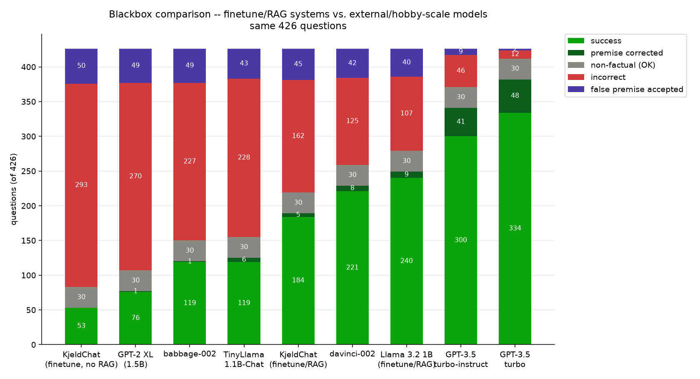

# KjeldGPT

A GPT trained from scratch on a combined Gutenberg + Wikipedia corpus (**KjeldGPT
1.1B**), plus a Q/A-finetuned variant (**KjeldChat 1.1B**) that answers questions in a
fixed `Question: ...\nAnswer: ...` format instead of just continuing prose, grounded by
retrieval-augmented generation (RAG) over a Wikipedia-only passage index (`chat.py`,
`rag/rag_retrieve.py`) rather than trying to recall facts from thin parametric memory.

The Q/A finetuning corpus and the RAG passage index are both Wikipedia-only, even
though the base model's own pretraining corpus stays the combined Gutenberg +
Wikipedia one described above (see `finetune/FINETUNE_PARAMS.md`'s "Wikipedia-only"
section for why: Gutenberg -- novels, first-person narratives, bibliography pages --
made unreliable RAG Context next to a Wikipedia article, and could out-score a better
Wikipedia match purely on corpus volume).

The base model is a means, not the end -- it's locked in place once trained (no
backtracking on days of compute), and everything that actually matters for the
finished product happens downstream of it: `finetune/` adapts it into a Q/A model,
`rag/` builds the passage database it answers from, and `test/` measures whether any
of that is actually working. Four features, one shared architecture (`model.py`):

```
.
├── model.py                  shared GPT implementation -- base training, finetuning,
│                              and chat.py all import this
├── chat.py                   terminal REPL against the finetuned model + RAG
├── chat_gui.py                browser-based (Gradio) chat UI -- same pipeline as
│                              chat.py, reuses its prompt templates/streaming directly
├── completion.py              REPL against the base model (raw text continuation --
│                              a test script now, not the deliverable)
├── logo.png
├── requirements.txt
├── LICENSE
│
├── base/                     everything for training the base model (KjeldGPT 1.1B)
│   ├── data/                  corpus prep (download -> clean -> train tokenizer -> tokenize)
│   │   ├── gutenberg/
│   │   │   ├── clean_gutenberg_dataset.py
│   │   │   └── clean_gutenberg/    (gitignored -- cleaned Gutenberg .txt files)
│   │   ├── wikipedia/
│   │   │   ├── clean_wikipedia_dataset.py
│   │   │   └── clean_wikipedia/    (gitignored -- cleaned Wikipedia .txt shards)
│   │   ├── vocab_dataset.py    trains the tokenizer jointly over both dirs above
│   │   └── tokenize_dataset.py
│   ├── base_train.py          pretraining loop
│   ├── BASE_PARAMS.md         corpus/model/hyperparameter reference for the pretrain run
│   ├── convert_to_safetensors.py  exports a checkpoint as safetensors + config.json
│   │                          + tokenizer.json, for publishing on Hugging Face --
│   │                          serves both models (--checkpoint/--out_dir), since
│   │                          both training scripts save the same dict shape
│   ├── MODEL_CARD.md          the Hugging Face card for KjeldGPT 1.1B -- tracked
│   │                          here, copied into hf_export/ at upload time
│   ├── checkpoints/           (gitignored -- base model weights)
│   └── insights/              (gitignored except plot_insights.py -- training logs/plots)
│       └── plot_insights.py   regenerates plots/ from logs/train_run.log (run from anywhere)
│
├── finetune/                  everything for Q/A-finetuning the base model (KjeldChat 1.1B)
│   ├── data/                  Q/A corpus generation (generate -> shuffle -> tokenize)
│   │   ├── generate_qa.py                          grounded Q/A from real Wikipedia passages
│   │   ├── generate_no_context_qa.py               no-context, non-factual Q/A pairs
│   │   ├── generate_false_premise_qa.py            with-context false-premise correction
│   │   ├── generate_false_premise_no_context_qa.py closed-book false-premise correction
│   │   │                                           (grounded in rag/'s Vital passages)
│   │   ├── generate_grounding_qa.py                targets demonstrated grounding
│   │   │                                           failures (qa_loop.py's own results)
│   │   │                                           with stricter, no-embellishment pairs
│   │   ├── shuffle_finetune.py
│   │   └── tokenize_finetune.py       also writes a prompt/answer loss mask
│   ├── finetune_train.py      finetuning loop (resumes a base checkpoint, never chains
│   │                          finetunes on top of finetunes)
│   ├── FINETUNE_PARAMS.md
│   ├── MODEL_CARD.md           the Hugging Face card for KjeldChat 1.1B
│   ├── checkpoints/            (gitignored -- finetuned model weights)
│   └── insights/               (gitignored except plot_insights.py -- finetuning logs/plots)
│       └── plot_insights.py
│
├── rag/                       everything for the RAG passage database chat.py retrieves from
│   ├── rag_retrieve.py         query-time retrieval over the passage index
│   ├── rag_rerank.py            cross-encoder reranking of the bi-encoder's top-10
│   │                           candidates -- the bi-encoder is a topical-similarity
│   │                           measure and repeatedly mis-ranks the specific right
│   │                           passage below a topically-similar wrong one
│   ├── fetch_vital_articles.py  the passage source: fetches real, live article text
│   │                           for Wikipedia's own community-curated Vital Articles
│   │                           (Level 5, ~45k titles) list via the MediaWiki API --
│   │                           deliberately not Claude-generated (see role note below).
│   │                           Chosen over a bulk full-dump chunking approach after
│   │                           head-to-head testing (test/qa_loop.py): the curated,
│   │                           much smaller pool scores far higher on precision since
│   │                           it isn't competing against millions of irrelevant
│   │                           passages for top-1
│   ├── embed_passages.py       embeds passages for the retrieval index (--passages_file
│   │                           for fetch_vital_articles.py's output, the current path;
│   │                           --wikipedia_dir for the legacy bulk-dump chunking mode)
│   ├── models/                 (gitignored -- local all-MiniLM-L6-v2 + cross-encoder
│   │                           snapshots; third-party weights, re-downloadable, see
│   │                           rag_retrieve.py's EMBED_MODEL_PATH comment)
│   └── data/                   mostly gitignored -- embeddings.npy, passages.txt,
│                               meta.json, and primary_articles/'s fetched passage
│                               JSONL are all rebuildable and large (the raw extracts
│                               alone are 1.1GB). The one tracked file is
│                               primary_articles/vital_level5_titles.txt, the ~45k-title
│                               input list that makes the fetch reproducible
│
├── spaces/                    the Hugging Face Space -- chat_gui.py's pipeline served
│   │                          publicly, generated from these sources rather than
│   │                          hand-maintained in a second repo
│   ├── app.py                  Space entrypoint: downloads weights/index/encoders from
│   │                           the Hub into the paths rag/ already looks in, then
│   │                           reuses chat_gui.build_respond_fn unchanged, wrapped in
│   │                           @spaces.GPU for ZeroGPU
│   ├── requirements.txt        inference-only deps (no anthropic/openai/matplotlib --
│   │                           none of it runs at inference, and every wheel is
│   │                           cold-start latency on a Space that sleeps)
│   ├── README.md               the Space card (YAML frontmatter + what to expect)
│   ├── build_space.py          assembles build/ from the files above + model.py,
│   │                           chat.py, chat_gui.py, rag/'s two retrieval modules
│   └── build/                  (gitignored -- regenerate with build_space.py)
│
└── test/                       QA-loop evaluation harness -- classifies real chat.py
    │                           answers (via chat.py's own retrieval + generation code
    │                           paths) rather than guessing at quality by hand
    ├── questions.py             factual/non-factual/complex-syntax/open-answer/
    │                           false-premise test questions
    ├── qa_loop.py               runs questions through chat.py's real pipeline (optionally
    │                           with --rerank), judges each answer with Claude
    │                           (relevance/correctness, not a source of the model's own
    │                           knowledge -- see note below)
    ├── diagnose_rag_precision.py  deeper look at "wrong context" failures: is a
    │                           relevant passage in the corpus at all, just ranked
    │                           wrong (lookup issue -- what rag_rerank.py targets), or
    │                           genuinely missing (data/coverage issue)?
    ├── generate_questions.py    generates additional test questions via Claude
    ├── qa_loop_external.py      runs the same questions against external models
    │                           (GPT-2 XL, TinyLlama, OpenAI completion models) closed-book,
    │                           for a like-for-like baseline
    ├── rejudge_blackbox.py      re-judges a whitebox run closed-book, so KjeldChat is
    │                           graded on the same "question in, answer out" basis as
    │                           the external models above
    ├── plot_qa_loop.py          plots each category's count as a trend across runs --
    │                           what moved between fixes, not a per-run snapshot
    │                           (that's already readable in runs/<name>_summary.json)
    ├── plot_model_comparison.py plots KjeldChat against the external baselines
    ├── runs/                    one output per qa_loop.py run (jsonl + summary.json) --
    │                           a track record for measuring progress across fixes
    └── plots/                   qa_loop_trend.png + model_comparison.png -- tracked, not
                                gitignored, for the same reason runs/ is: they are the
                                project's results, not regenerable run artifacts
```

Claude's role in this project is deliberately bounded to three places: generating
synthetic Q/A pairs *from* real content (`finetune/data/generate_*.py`, all grounded in
either a real Wikipedia passage or a real retrieved-context/model-failure case, never
invented from Claude's own knowledge), coding assistance, and testing (`test/`) --
never as the source of factual passage content itself. A gap in the RAG corpus gets
patched with real fetched Wikipedia text (`rag/fetch_vital_articles.py`), not a passage
Claude wrote from its own memory -- otherwise the model would just be restating a
bigger model's knowledge instead of its own from-scratch training.

## Results



426 questions -- 346 factual (plain lookups, complex syntax, open explanatory), 50
false-premise, 30 non-factual -- run through every model and graded by the same Claude
judge. This is a **blackbox** comparison: question in, answer out. KjeldChat's own
retrieval is invisible here, exactly as it would be to someone testing seven unknown
systems, and no external model is handed a retrieved passage. Handing them one would
only measure "can a bigger model read context", which is the one part of the pipeline
that isn't the point.

KjeldChat answers 150/426 correctly. It clears GPT-2 XL (53, at 1.5B params), TinyLlama
1.1B-Chat (73) and babbage-002 (94), and lands below davinci-002 (191) and the GPT-3.5
pair (298, 331). That is roughly where a 1.1B model trained for ~7.5 days on one GPU
should land, and the ordering is the interesting part: the models it beats include one
larger than it and one instruction-tuned at the same size.

False-premise handling is the weakest of its trained behaviors: of 50 questions
embedding a false premise, KjeldChat explicitly corrects 5 and accepts 45 (inventing a
supporting fact rather than flagging the error) -- weaker than davinci-002's 8/42 and
TinyLlama's 6/44 at the same task. That behavior doesn't come from scale; it comes from
~4,000 targeted training pairs (`finetune/data/generate_false_premise_*.py`), which
help against a fully naive baseline but don't close the gap to models with a stronger
pretrained prior to draw on.

`test/plots/qa_loop_trend.png` tracks the whitebox view across v1-v7 -- the same runs
split into *why* each answer failed (retrieval missed it, retrieved the wrong passage,
or had the right passage and didn't use it), which is what actually drove each fix.
Reproduce either chart with `test/plot_model_comparison.py` / `test/plot_qa_loop.py`.

## Setup

```
pip install -r requirements.txt
```

Training and finetuning both expect a CUDA GPU (see `base/BASE_PARAMS.md` /
`finetune/FINETUNE_PARAMS.md` for the actual hardware used); `chat.py` /
`completion.py` fall back to CPU.

## Running the pipelines

Each stage script documents its own invocation in its module docstring, and each
`data/` directory expects to be run from within itself (`cd base/data`,
`cd finetune/data`). Full corpus stats, hyperparameters, and rationale live in
`base/BASE_PARAMS.md` and `finetune/FINETUNE_PARAMS.md` -- start there.

Quick tour once checkpoints exist:
```
python completion.py            # talk to the base model (raw text continuation)
python chat.py                  # talk to the finetuned model + RAG (Q/A format, spoken aloud)
python chat_gui.py              # same pipeline as chat.py, served as a browser chat UI
```

## What's not tracked

`base/checkpoints/`, `finetune/checkpoints/`, `base/data/` corpus files,
`rag/data/` (the RAG index, kept separate from the base model's own training data),
`rag/models/`, and both `insights/` dirs' logs/plots are all gitignored -- see
`.gitignore`. Checkpoints are multi-GB and personal to whoever ran the training;
`rag/models/` is third-party sentence-transformer weights, not this project's work;
each `insights/plots/` regenerates from its sibling `logs/train_run.log` via its
`plot_insights.py`.

Everything ignored is reproducible from what is tracked: the data-prep scripts rebuild
the corpora, `rag/fetch_vital_articles.py` + `embed_passages.py` rebuild the passage
index from the tracked `vital_level5_titles.txt`, and the two `*_train.py` scripts
retrain the models. What is tracked is the source, the parameters
(`BASE_PARAMS.md`/`FINETUNE_PARAMS.md`), and the full evaluation track record
(`test/runs/`, `test/plots/`) -- about 7MB in total.

Model weights are published separately on Hugging Face rather than committed here:

- [`kristofferkjeldby/KjeldGPT-1.1B`](https://huggingface.co/kristofferkjeldby/KjeldGPT-1.1B) -- the base model
- [`kristofferkjeldby/KjeldChat-1.1B`](https://huggingface.co/kristofferkjeldby/KjeldChat-1.1B) -- the finetuned model (v7)

`base/convert_to_safetensors.py` produces the `safetensors` + `config.json` +
`tokenizer.json` export for both:

```
cd base
python3 convert_to_safetensors.py                        # -> base/hf_export
python3 convert_to_safetensors.py \
    --checkpoint ../finetune/checkpoints/kjeldchat_v7.pt \
    --out_dir ../finetune/hf_export                      # -> finetune/hf_export
```

Neither `hf_export/` is tracked (they're rebuildable from a checkpoint), but the two
`MODEL_CARD.md` files are -- copy one in as `README.md` before uploading, so the card
lives under version control alongside the code it documents rather than only on the
Hub. Note that these are custom-architecture weights, not `transformers` models: they
load via this repo's own `model.py`, and both cards lead with that.

## License

MIT -- see `LICENSE`.
